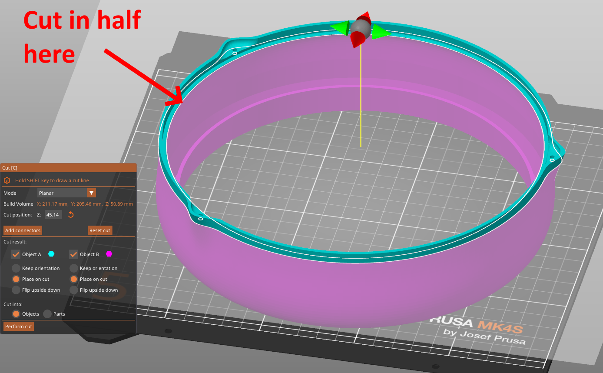

# Introduction
This repo contains the 3D printed parts and printing instructions for a Big Red^H^H^HRound Button, part of the front garden railway project.  For assembly instructions see here:

https://www.meades.org/misc/big_round_button/big_round_button.html

For more general information on the front garden railway see here:

https://www.meades.org/railways/garden/garden.html

The main file is `big_round_button.blend`, the components of which are exported to a number of `big_round_button*.stl` files at a Blender scale factor of 1000 to give real size in millimetres. `_xY` on the end of an `stl` file name means you will need to print `Y` of those parts (e.g. six of `big_round_button_spring_support_x6.stl`).

# Printing
## `big_round_button_button.stl`
The chief challenge with this print is getting the button to come out as transparent as possible.  For my [Prusa MK4S](https://www.prusa3d.com/product/original-prusa-mk4s-3d-printer-5/) filament printer I took the PrusaSlicer generic PETG settings and, based on the advice [here](https://forum.prusa3d.com/forum/original-prusa-i3-mk3s-mk3-how-do-i-print-this-printing-help/transparent-petg/) and [here](https://www.printables.com/model/15310-how-to-print-glass), made the following modifications:

- set 100% in-fill: a solid mass of plastic,
- set the maximum print speed for all types of print to 20&nbsp;mm/s: nice and slow,
- reduced the cooling fan to between 10% and 15%,
- increase the temperature to 250&nbsp;C to ensure melding of adjacent layers,
- set the layer height to 0.1&nbsp;mm (greatest detail, packing more filament in),
- increase the filament flow rate to 5% greater than normal; this will compress the layers nice and hard,
- set the fill type and the support interface layer type to concentric: this should match the shape of the button,
- set the in-fill angle to zero degrees; this should make the outer layers print as a horizontal/vertical grid,
- enabled a safety feature in the slicer program to not have the nozzle cross perimeters, reducing the changes of it hitting anything.

Then I printed the button (`big_round_button_button.stl`) in SUNLU transparent white PETG, supports required on the build plate.  The print will probably take two or three days with these settings.

Note that PETG is not UV-safe, I don't believe there is a UV-safe transparent filament; the button will just need to be replaced every few years.

## `big_round_button_housing.stl`
When printed in \[black\] ASA, this part also presents a challenge.  Printing in PLA, one can plop the object down on its front face, no supports, jobs a good'un, however ASA just won't stick to the build plate that well.  Instead, what I did was to cut the object in half in my printer's slicer program right in the widest part of the sticky-out bit where `big_round_button_back.stl` rests inside the housing, placing the two halves down on their cut faces.  This provides the largest surface area in contact with the build plate.  The print does, of course, require supports now, which will take some removing, and the two parts will have to be (carefully!) glued together again afterwards with cyanoacrylate adhesive, but it does survive the printing process and the front curved portion is nice and rounded, rather then distorted through having been squidged to the build plate.

I also printed this part at 0.1&nbsp;mm layer height to make that curve nice and continuous.

Settings are otherwise the same as for everything else ASA (see below), though adding an \[internal, 'cos you might not have room for an external one\] brim is probably advisable.

## Everything Else
Everything else should be printed in natural ASA (for UV-safety, natural ASA for improved reflectivity), fastest speed, 15% in fill, no supports required except for `big_round_button_back.stl` and `big_round_button_usb_c_hole_cap.stl`, which are relatively complex shapes and so should have supports everywhere.  As with all of the larger/flatter parts I got the room up to 45&nbsp;C with a space heater (my printer is inside a large wooden box but has no direct heating), got my slicer program to add a draft excluder (where room was available), minimised the fan and reduced the speed to 40&nbsp;mm/s max.